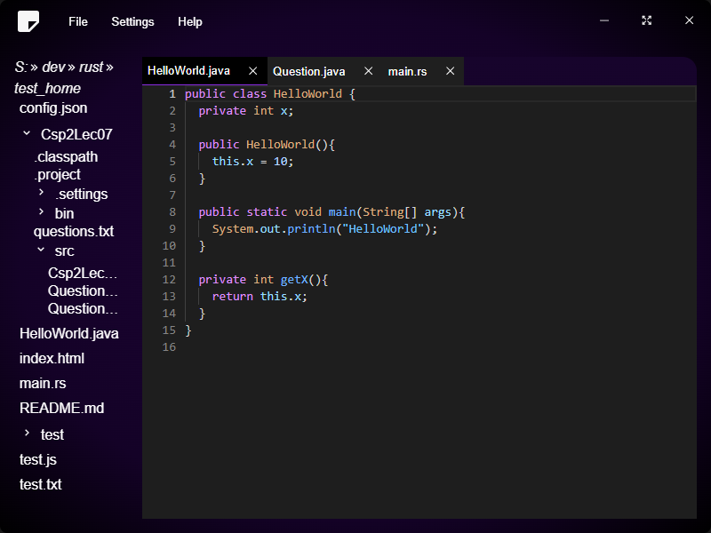

# branchy text editor

branchy text editor is a editor build from the tauri framework and it's frontend is from Solidjs. Plus it has Tree-sitter using as the syntax highlighting.

## Currently supported platform

- Windows x86 (only)

## Currently supported text (With syntax hightlighting)

- Rust
- JavaScript
- Html
- Json
